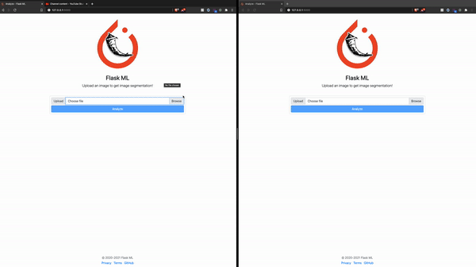

# Flask-ML
Image and video processing from human perspectives are quite popular for artificial intelligence services like traffic inspection. Flask-ML grants any type of user (not only data scientist) an easy and compact UI Tool that supports BentoML to process images based on state-of-the-art machine learning approaches. It hides hardcore algorithm design and data preprocessing procedure into backend service which even annoys researchers a lot. 

 
## Quick Demo 


## Requirement
- Python 3.7
- pipenv install: `pip3 install pipenv`

## Getting Started

```sh
# Clone the project
$ git clone https://github.com/MLH-Fellowship/Flask-ML.git

# Install
$ pipenv install

# Run Application
$ pipenv run python app.py
```

## Running
Open Localhost and try it out http://127.0.0.1:5000/

## Inspiration
Many real-world applications like traffic inspection depend on instance-level segmentation and identification using our offline video processing model of Mask-RCNN.

As the backbone of instance-level object detection, image segmentation plays an important role to judge whether an algorithm works well for both accuracy and efficiency. It's the process of dividing an image into different regions based on the characteristics of pixels to identify objects or boundaries to simplify an image and more efficiently analyze it. Segmentation impacts a number of domains, from the filmmaking industry to the field of medicine. For instance, the software behind green screens implements image segmentation to crop out the foreground and place it on a background for scenes that cannot be shot or would be dangerous to shoot in real life. Image segmentation is also used to track objects in a sequence of images and to classify terrains, like petroleum reserves, in satellite images. Some medical applications of segmentation include the identification of injured muscle, the measurement of bone and tissue, and the detection of suspicious structures to aid radiologists (Computer-Aided Diagnosis, or CAD).

BentoML is a framework for serving, managing, and deploying machine learning models, but it can only be used via Postman or CLI, and quite complicated for many users or developers. Hence, we want to solve this problem by implementing the abstract web application with the help of open-sourced projects like Python/ Flask and Jinja.

## How We built it
We’re a team of 3, who come in with different backgrounds and technical expertise. Hence, we picked 3 open-source projects to explore individually, and then, learn how to integrate them to solve the stated problem. 

The project is built as a 2-tier architecture using Python/Flask, flask-caching, and Multi-threading for the backend and Bootstrap, Jinja, and Javascript for the client. Finally, we use BentoML as a core service to analyze the uploading images

Besides, after each completed our own individual task, we use Github Issue, PR, rebase, and squash to reduce merge conflict. We did a really good job as there are no merge conflicts at all.

## Challenges we ran into
- At first, we made a POST request to BentoML API, we encounter a similar problem in Javascript that BentoML's analysis takes quite long to return the result and it causes an event blocking on the client-side. So we had to switch strategy and use Popen and multi-threadings to run multiple BentoML CLIs in Python, and it works.

- Another challenge was to implement flask caching because Flask caching does not have very good documentation like Redis Cache, so it took us a while to implement that feature, and display the result on the client with Jinja. Adding Flask Cache has reduced the number of API calls to our server and provide a faster result time. 

## Accomplishments & Lesson Learned

### Intro to the Team
Calvin Nguyen: Born and raised in Vietnam, move to San Jose State University, San Jose, California to pursue B.S. in Software Engineer

Noah Cardoza: Born in San Jose and raised between Egypt, Thailand, and Athens, graduated with an A.A. in Enterprise Security from De Anza College in Cupertino.

Yida Wang: Born in China and pursuing a Ph.D. degree in Technical University of Munich, Germany, focusing on computer vision and machine learning R&D

### Contributions and Lesson Learned
**Calvin Nguyen:**
- Built the backend APIs using Flask, and worked together on the integration among BentoML service, and the client-side. 
- Implemented Flask-caching so when the user uploads the same image, it will return the result right away.
- He learns to build the backend services using Flask, to open/read a file using the filesystem.
- He also learns about BentoML, and how to use it. Especially, because Bento ML takes sometimes to analyze the data, he and Noah did pair programming to come up with a solution to integrate bentoML services with our main backend API using multi-threading.

**Noah Cardoza:**
- Did the initial project setup, configuring Pipenv with the base modules we'd need to get a start on the project.
- Built the UI using Bootstrap 4 with Jinja to template the pages required for the front end.
- Pair programmed with Calvin to integrate Flask with BentoML in a non-blocking event.
- Prototyped the results template using Jinja which Calvin later enhanced with a loading animation.

**Yida Wang:**
- Configured the BentoML
- Trained the segmentation model
- Saved the resulting output of the segmentation model into a folder from which we could display it to the user.

## What's next for Flask ML
The vision of this project is for the user can upload many files or folders, but we didn't have enough time to complete upload many files. Hence, we're uploading and analyzing one file as a proof of concept.

There are many more things we want to add:
1. Allow user to upload a folder and return image segmentation for all uploaded images
2. Allow user to share images with others
3. Provide a textual explanation of what exactly is going on for users less versed in ML.
