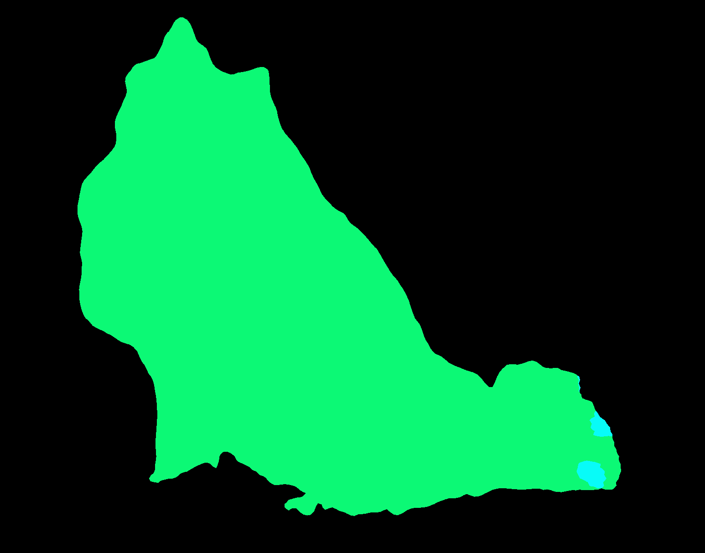

# Image Classification
Firstly, you can try it out with Python to train a model for image classification, such model will be packaged as a BentoML package for easier deplyment afterwords.
```python
python3 main.py
```

Such BentoML package is placed in `trained_model` folder, you can execute it with 
```bash
bentoml run PytorchImageClassifier:latest predict  --input-file=dog.jpg
```
Then following infos will be printed:
```
INFO - {'service_name': 'PytorchImageClassifier', 'service_version': '20201008191758_DAF5E5', 'api': 'predict', 'task': {'data': {'uri': 'file:///Users/yidawang/Documents/gitfarm/Flask-ML/img_process_backend/dog.jpg', 'name': 'dog.jpg'}, 'task_id': 'e2dedc9f-b6eb-4116-950c-ad71e66b0f7f', 'cli_args': ('--input-file=dog.jpg',)}, 'result': {'data': '"cat"', 'http_status': 200, 'http_headers': (('Content-Type', 'application/json'),)}, 'request_id': 'e2dedc9f-b6eb-4116-950c-ad71e66b0f7f'}
```

Now I successfullly package classification with BentoML, segmentation only works for running with Python rather than BentoML with packaged model.

# Image Segmentation
For sake of a good demo, I believe that we need the segmentation as richer API, now it works with Python

```python
python3 main_segmentation.py
```
The predicted result would look like followings:
 
