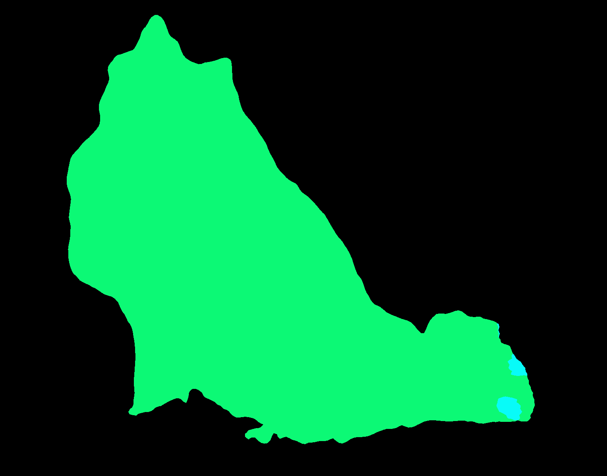
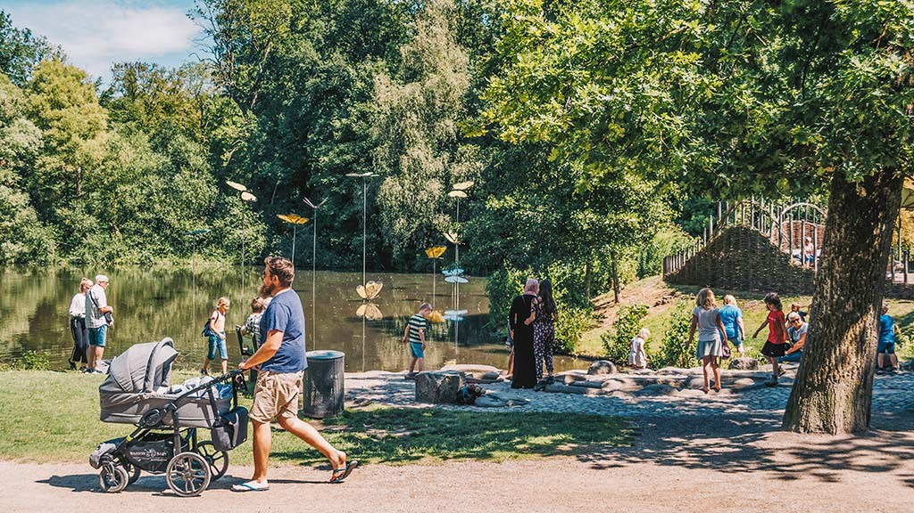
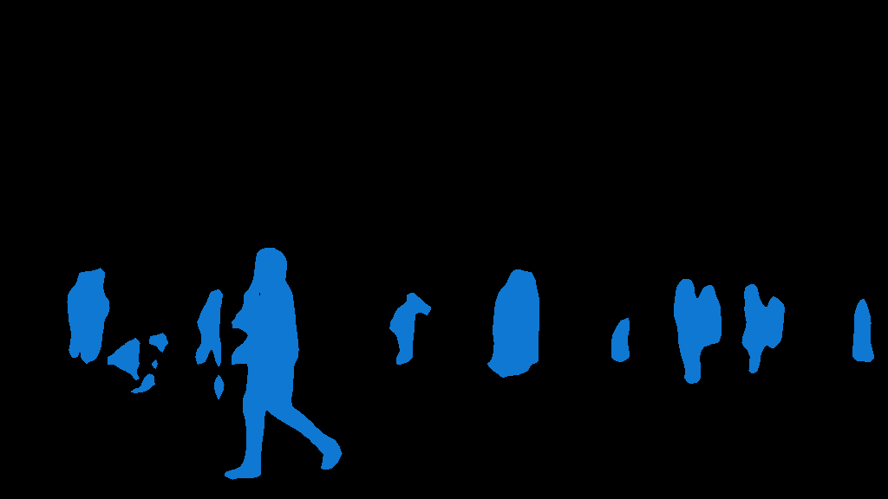
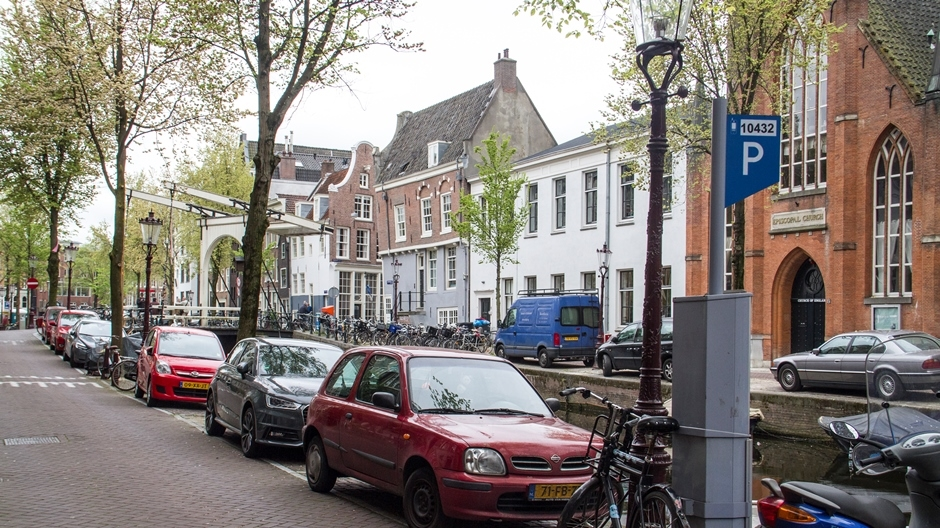
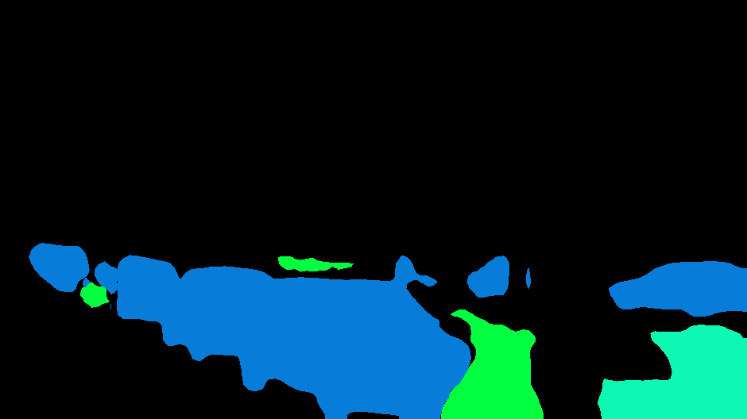
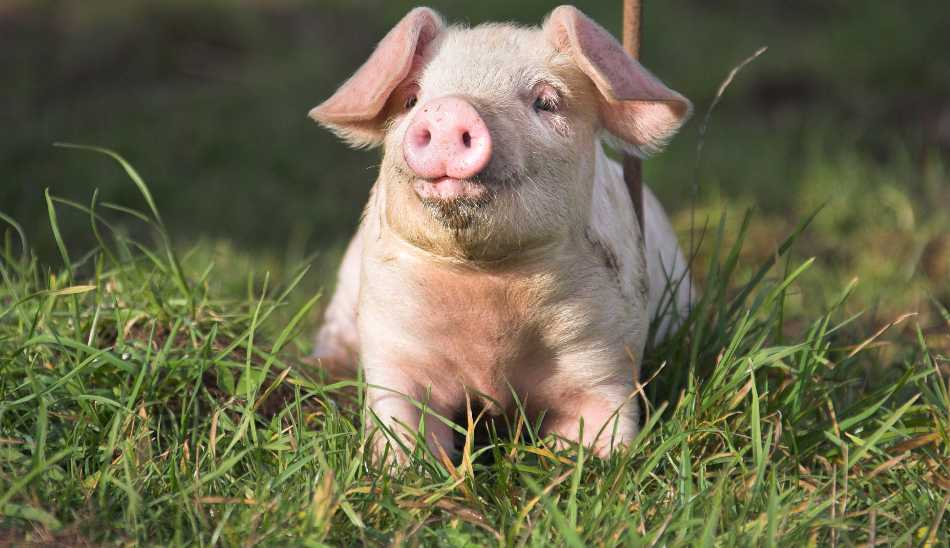
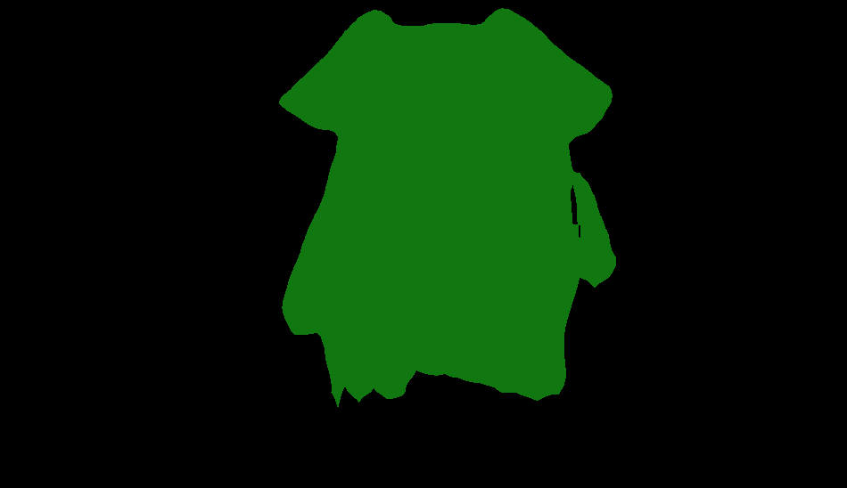
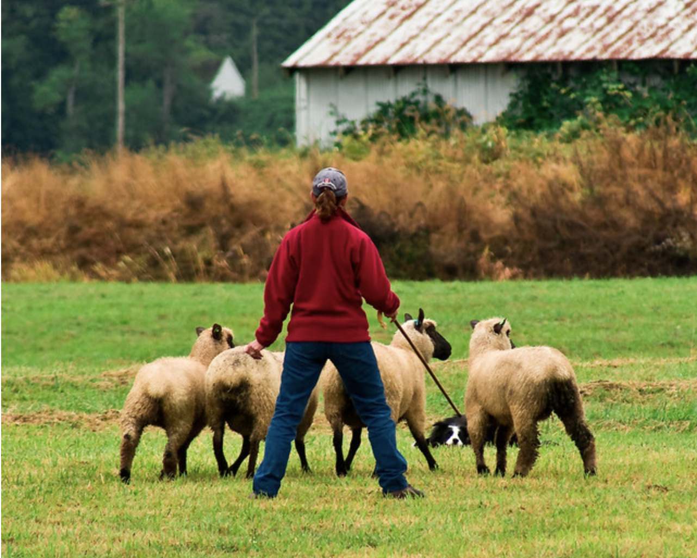
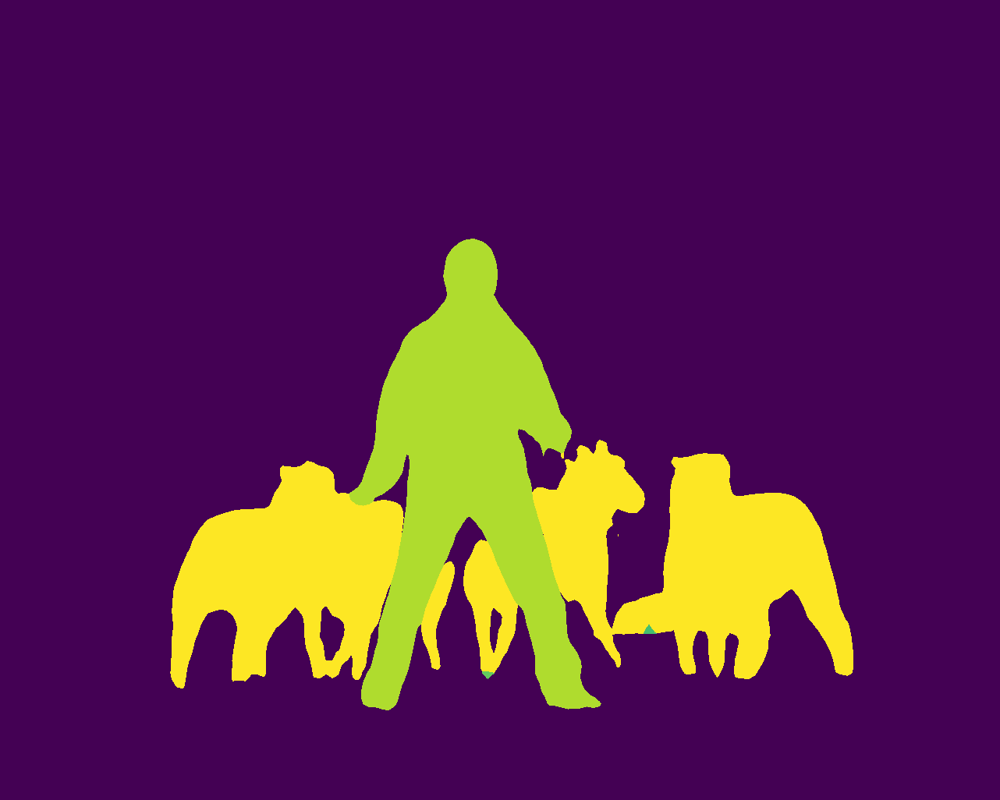
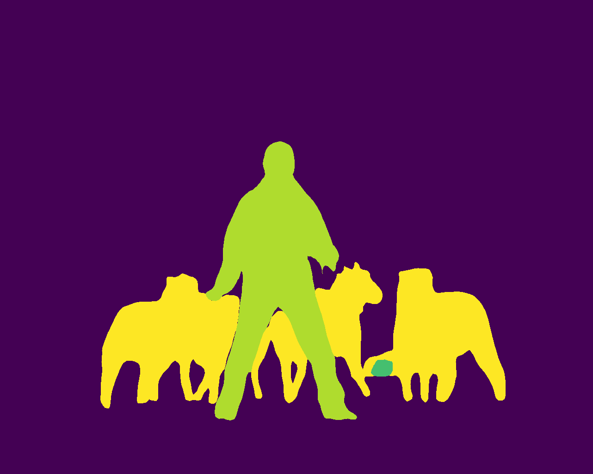

# Targeted tasks
Many real world application like traffic inspection depends on instence-level segmentation and identification which is shown as below using our offline video processing model of Mask-RCNN.
| Observation | Object detection |
:-------------------------:|:-------------------------:
  | 

As the backbone of instance-level object detection, image segmentation plays an important role to judge whether an algorithm works well for both accuracy and efficiency.
Image segmentation is the process of dividing an image into different regions based on the characteristics of pixels to identify objects or boundaries to simplify an image and more efficiently analyze it. Segmentation impacts a number of domains, from the filmmaking industry to the field of medicine. For instance, the software behind green screens implements image segmentation to crop out the foreground and place it on a background for scenes that cannot be shot or would be dangerous to shoot in real life. Image segmentation is also used to track objects in a sequence of images and to classify terrains, like petroleum reserves, in satellite images. Some medical applications of segmentation include the identification of injured muscle, the measurement of bone and tissue, and the detection of suspicious structures to aid radiologists (Computer Aided Diagnosis, or CAD).
# Toy example - Image classification

Firstly, you can try it out with Python to train a model for image classification, such model will be packaged as a BentoML package for easier deplyment afterwords.
There will be some imeges from CIFAR-10 poping out as well for you to understand how it works for image classification.
```python
python3 bentoml_img_classify.py
```

As for me, the newly generated BentoML packages will be stored at:
```
/Users/yidawang/bentoml/repository/PytorchImageSegment/
```

Such BentoML package for image classfication is already placed in `bentoml_package_cls` folder, you can execute it with 
```bash
bentoml run PytorchImageClassifier:latest predict  --input-file=dog.jpg
```

Then following infos will be printed:
```
INFO - {'service_name': 'PytorchImageClassifier', 'service_version': '20201008191758_DAF5E5', 'api': 'predict', 'task': {'data': {'uri': 'file:///Users/yidawang/Documents/gitfarm/Flask-ML/img_process_backend/dog.jpg', 'name': 'dog.jpg'}, 'task_id': 'e2dedc9f-b6eb-4116-950c-ad71e66b0f7f', 'cli_args': ('--input-file=dog.jpg',)}, 'result': {'data': '"cat"', 'http_status': 200, 'http_headers': (('Content-Type', 'application/json'),)}, 'request_id': 'e2dedc9f-b6eb-4116-950c-ad71e66b0f7f'}
```

Now I successfullly package classification with BentoML, segmentation only works for running with Python rather than BentoML with packaged model.

# Image segmentation
For sake of a good demo, I believe that we need the segmentation as richer API, now it works with Python

```python
python3 bentoml_img_segment.py
```
Then a new folder containing all bentoML services like:
```
/Users/yidawang/bentoml/repository/PytorchImageSegment/20201010015248_3360B3
├── Dockerfile
├── MANIFEST.in
├── PytorchImageSegment
│   ├── __init__.py
│   ├── __pycache__
│   │   └── pytorch_image_segment.cpython-37.pyc
│   ├── artifacts
│   │   ├── __init__.py
│   │   └── net.pt
│   ├── bentoml.yml
│   └── pytorch_image_segment.py
├── README.md
├── bentoml-init.sh
├── bentoml.yml
├── docker-entrypoint.sh
├── environment.yml
├── python_version
├── requirements.txt
└── setup.py
```

Such BentoML package for image classfication is already placed in `bentoml_package_seg` folder, you can execute it with 
```bash
bentoml run PytorchImageSegment:latest predict  --input-file=images/trees.jpg
bentoml run PytorchImageSegment:latest predict  --input-file=images/street.jpg
bentoml run PytorchImageSegment:latest predict  --input-file=images/pig.jpg
bentoml run PytorchImageSegment:latest predict  --input-file=images/dog.jpg
```
The predicted result would look like followings:
| Input image | Estimated segment |
:-------------------------:|:-------------------------:
  | 
  | 
  | 
  | 

# Flexible model choices
To balance the inference speed and estimation accuracy, different models could be served as segmentation backends, such as [DEEPLABV3-RESNET101](https://pytorch.org/hub/pytorch_vision_deeplabv3_resnet101/) and [FCN-RESNET101](https://pytorch.org/hub/pytorch_vision_fcn_resnet101/)
| Input image | FCN-RESNET101 | DEEPLABV3-RESNET101 |
:-------------------------:|:-------------------------:|:-------------------------:
  |  | 
